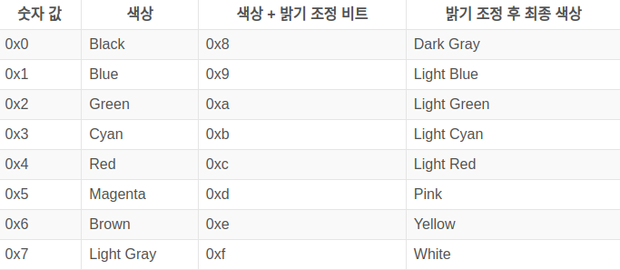
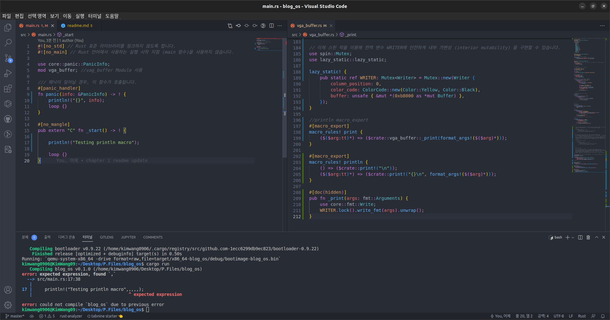
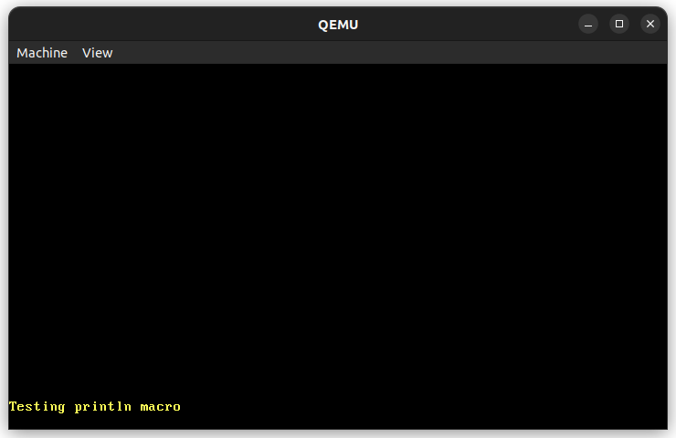

# 최소한의 기능을 담은 Kernel

우리의 호스트 시스템 triple을 위해 컴파일하는 경우,

Rust 컴파일러와 링커는 Linux나 Windows와 같은 운영체제가 있다고 가정하고 또한 운영체제가

C 런타임 시스템을 사용할 것이라고 가정하기 때문에 링커 오류 메세지가 출력된 것입니다.

이런 링커 오류를 피하려면 운영체제가 없는 시스템 환경에서 코드가 구동하는 것을 목표로 컴파일해야 합니다.

운영체제가 없는 bare metal 시스템 환경의 한 예시로 thumbv7em-none-eabihf target triple이 있습니다.

(이는 임베디드 ARM 시스템을 가리킵니다.) Target triple의 none은 시스템에 운영체제가 동작하지 않음을 의미하며,

이 target triple의 나머지 부분의 의미는 아직 모르셔도 괜찮습니다.

이 시스템 환경에서 구동 가능하도록 컴파일하려면 rustup에서 해당 시스템 환경을 추가해야 합니다.

    rustup target add thumbv7em-none-eabihf

위 명령어를 실행하면 해당 시스템을 위한 Rust 표준 라이브러리 및 코어 라이브러리를 설치합니다.

이제 해당 target triple을 목표로 하는 freestanding 실행파일을 만들 수 있습니다

    cargo build --target thumbv7em-none-eabihf

--target 인자를 통해 우리가 해당 bare metal 시스템을 목표로 크로스 컴파일할 것이라는 것을 cargo에게 알려줍니다.

목표 시스템 환경에 운영체제가 없는 것을 링커도 알기 때문에

C 런타임을 링크하려고 시도하지 않으며 이제는 링커 에러 없이 빌드가 성공할 것입니다.

## 참고 자료

    https://os.phil-opp.com/ko/

## 주의

    현재 /home/자신의 계정이름/.cargo 경로에 config.toml 파일로 인해 기존 rust 개발환경에 문제가 있을 수 있습니다.
    이는 추후 해결할 예정입니다.

## Chapter 1:

### Source code

    /*
        운영체제 커널을 만드는 첫 단계는 표준 라이브러리(standard library)를 링크하지 않는 Rust 실행파일을 만드는 것입니다. 
        이러한 실행파일은 운영체제가 없는 bare metal 시스템에서 동작할 수 있습니다.

        운영체제에 의존하지 않으려면 Rust 표준 라이브러리의 많은 부분을 사용할 수 없습니다. 
        그래도 우리가 이용할 수 있는 Rust 언어 자체의 기능들은 많이 남아 있습니다. 
        예를 들어 반복자, 클로저, 패턴 매칭, option / result, 문자열 포맷 설정, 그리고 소유권 시스템 등이 있습니다. 
        이러한 기능들은 우리가 커널을 작성할 때 undefined behavior나 
        메모리 안전성에 대한 걱정 없이 큰 흐름 단위의 코드를 작성하는 데에 집중할 수 있도록 해줍니다.
    */
    #![no_std]
    #![no_main]

    use core::panic::PanicInfo;

    /// 패닉이 일어날 경우, 이 함수가 호출됩니다.
    #[panic_handler]
    fn panic(_info: &PanicInfo) -> ! {
        loop {}
    }

    #[no_mangle]
    pub extern "C" fn _start() -> ! {
        loop {}
    }
    /*
        #[no_mangle] 속성을 통해 name mangling을 해제하여 
        Rust 컴파일러가 _start 라는 이름 그대로 함수를 만들도록 합니다. 
        이 속성이 없다면, 컴파일러가 각 함수의 이름을 고유하게 만드는 과정에서 
        이 함수의 실제 이름을 _ZN3blog_os4_start7hb173fedf945531caE 라는 이상한 이름으로 바꿔 생성합니다. 
        우리가 원하는 실제 시작 지점 함수의 이름을 정확히 알고 있어야
        링커 (linker)에도 그 이름을 정확히 전달할 수 있기에 (후속 단계에서 진행) #[no_mangle] 속성이 필요합니다.

        또한 우리는 이 함수에 extern "C"라는 표시를 추가하여 
        이 함수가 Rust 함수 호출 규약 대신에 C 함수 호출 규약을 사용하도록 합니다. 
        함수의 이름을 _start로 지정한 이유는 그저 런타임 시스템들의 실행 시작 함수 이름이 대부분 _start이기 때문입니다.

        ! 반환 타입은 이 함수가 발산 함수라는 것을 의미합니다. 
        시작 지점 함수는 오직 운영체제나 부트로더에 의해서만 직접 호출됩니다.
        따라서 시작 지점 함수는 반환하는 대신 운영체제의 exit 시스템콜을 이용해 종료됩니다. 
        우리의 “freestanding 실행 파일” 은 실행 종료 후 더 이상 실행할 작업이 없기에, 
        시작 지점 함수가 작업을 마친 후 기기를 종료하는 것이 합리적입니다.
        여기서는 일단 ! 타입의 조건을 만족시키기 위해 무한루프를 넣어 줍니다.
    */

## Chapter 2:

### Cargo bootimage init

    https://hacking-yi.kro.kr/?p=233

#### Cargo.toml 파일에 아래 코드 추가

    [dependencies]
    bootloader = "0.9.8"

#### bootimage 설치

    cargo install bootimage

    rustup component add llvm-tools-preview

### 빌드 방법

    cargo build 대신 cargo bootimage를 사용하여 빌드할 수 있습니다.

### QEMU init

    sudo apt install qemu

    sudo apt install qemu-system-x86 && sudo apt install qemu-system-x86-xen

#### QEMU 가상환경 실행 코드

    qemu-system-x86_64 -drive format=raw,file=target/x86_64-blog_os/debug/bootimage-blog_os.bin

    qemu-system-x86_64 -drive format=raw,file=target/파일의 경로

#### 실제 컴퓨터에서 부팅하기

    dd if=target/x86_64-blog_os/debug/bootimage-blog_os.bin of=/dev/sdX && sync
    /dev/기기명

### Source code

    #![no_std] // Rust 표준 라이브러리를 링크하지 않도록 합니다.
    #![no_main] // Rust 언어에서 사용하는 실행 시작 지점 (main 함수)을 사용하지 않습니다.

    use core::panic::PanicInfo;

    // 패닉이 일어날 경우, 이 함수가 호출됩니다.
    #[panic_handler]
    fn panic(_info: &PanicInfo) -> ! {
        loop {}
    }

    static HELLO: &[u8] = b"Hello World!";

    #[no_mangle]
    pub extern "C" fn _start() -> ! {
        let vga_buffer = 0xb8000 as *mut u8;

        for (i, &byte) in HELLO.iter().enumerate() {
            unsafe { // 무슨 일이 있어도 unsafe는 최소한으로 사용할 것
                *vga_buffer.offset(i as isize * 2) = byte;
                *vga_buffer.offset(i as isize * 2 + 1) = 0xb;
            }
        }

        loop {}
        /*
            우선 정수 0xb8000을 raw 포인터로 형변환 합니다.
            그 다음 static (정적 변수) 바이트 문자열 HELLO의 반복자를 통해 각 바이트를 읽고,
            enumerate 함수를 통해 각 바이트의 문자열 내에서의 인덱스 값 i를 얻습니다.
            for문의 내부에서는 offset 함수를 통해 VGA 버퍼에 문자열의 각 바이트 및 색상 코드를 저장합니다.
            (0xb: light cyan 색상 코드)
        */
    }

Chapter 3:

## 용어 정리

### VGA

    비디오 그래픽스 어레이(VGA, 영어: Video Graphics Array)는 IBM사가 1987년에 제정한 아날로그 방식의 컴퓨터 디스플레이 표준

### Buffer

    데이터를 한 곳에서 다른 한 곳으로 전송하는 동안 일시적으로 그 데이터를 보관하는 메모리의 영역

## VGA 텍스트 모드

    VGA 텍스트 모드를 통해 쉽게 화면에 텍스트를 출력할 수 있습니다.

## VGA 텍스트 버퍼

    VGA 텍스트 모드에서 화면에 문자를 출력하려면 VGA 하드웨어의 텍스트 버퍼에 해당 문자를 저장해야 합니다. 
    VGA 텍스트 버퍼는 보통 25행 80열 크기의 2차원 배열이며, 해당 버퍼에 저장된 값들은 즉시 화면에 렌더링 됩니다. 
    배열의 각 원소는 화면에 출력될 문자를 아래의 형식으로 표현합니다:

    첫 바이트는 ASCII 인코딩으로 출력될 문자를 나타냅니다. 
    엄밀히 따지자면 ASCII 인코딩이 아닌, 해당 인코딩에 문자들을 추가하고 살짝 변형한 code page 437 이라는 인코딩을 이용합니다. 
    설명을 간소화하기 위해 이하 본문에서는 그냥 ASCII 문자로 지칭하겠습니다.

    두 번째 바이트는 표현하는 문자가 어떻게 표시될 것인지를 정의합니다. 
    두 번째 바이트의 첫 4비트는 전경색을 나타내고, 그 다음 3비트는 배경색을 나타내며,
    마지막 비트는 해당 문자가 화면에서 깜빡이도록 할지 결정합니다.
    아래의 색상들을 이용할 수 있습니다:

    두 번째 바이트의 네 번째 비트 (밝기 조정 비트)를 통해 파란색을 하늘색으로 조정하는 등 색의 밝기를 변경할 수 있습니다. 
    배경색을 지정하는 3비트 이후의 마지막 비트는 깜빡임 여부를 지정합니다.

    메모리 맵 입출력 (memory-mapped I/O)으로 메모리 주소 0xb8000을 통해 VGA 텍스트 버퍼에 접근할 수 있습니다. 
    해당 주소에 읽기/쓰기 작업을 하면 RAM 대신 VGA 텍스트 버퍼에 직접 읽기/쓰기가 적용됩니다.

    메모리 맵 입출력 적용 대상 하드웨어가 일부 RAM 작업을 지원하지 않을 가능성을 염두해야 합니다.
    예를 들어, 바이트 단위 읽기만 지원하는 장치로부터 메모리 맵 입출력을 통해 u64를 읽어들일 경우 쓰레기 값이 반환될 수도 있습니다.
    다행히 텍스트 버퍼는 일반적인 읽기/쓰기 작업들을 모두 지원하기에 읽기/쓰기를 위한 특수 처리가 필요하지 않습니다.

## Day 2 Result

### println 매크로를 이용하여 VGA로 출력하게 하는 코드

### 결과화면

## Source code

### VGA 관련 코드는 관련 공부를 하고 다시 볼 예정입니다.

    #[allow(dead_code)]
    #[derive(Debug, Clone, Copy, PartialEq, Eq)]
    #[repr(u8)]
    //색상을 정의합니다.
    pub enum Color {
        Black = 0,
        Blue = 1,
        Green = 2,
        Cyan = 3,
        Red = 4,
        Magenta = 5,
        Brown = 6,
        LightGray = 7,
        DarkGray = 8,
        LightBlue = 9,
        LightGreen = 10,
        LightCyan = 11,
        LightRed = 12,
        Pink = 13,
        Yellow = 14,
        White = 15,
    }

    #[derive(Debug, Clone, Copy, PartialEq, Eq)]
    #[repr(transparent)]
    struct ColorCode(u8);

    //배경색은 ColorCode를 통해 표현됩니다.
    impl ColorCode {
        fn new(foreground: Color, background: Color) -> ColorCode {
            ColorCode((background as u8) << 4 | (foreground as u8))
        }
    }

    #[derive(Debug, Clone, Copy, PartialEq, Eq)]
    #[repr(C)] 
    //컴파일 중 구조체의 각 필드가 저장되는 순서가 바뀌지 않게 하기 위해 C 구조체 처럼 사용합니다.
    struct ScreenChar {
        ascii_character: u8,
        color_code: ColorCode,
    }

    /*  
        버퍼의 크기,
        배경색은 배퍼의 크기만큼 지정됩니다.
    */
    const BUFFER_HEIGHT: usize = 25;
    const BUFFER_WIDTH: usize = 80;

    use volatile::Volatile;

    struct Buffer {
        chars: [[Volatile<ScreenChar>; BUFFER_WIDTH]; BUFFER_HEIGHT],
    }

    //실제로 화면에 출력되는 타입
    pub struct Writer {
        column_position: usize,
        color_code: ColorCode,
        buffer: &'static mut Buffer,
    }

    impl Writer { //self는 Writer를 가리키고 있습니다.
        // ASCII 바이트를 출력하는 함수를 만듭니다.
        pub fn write_byte(&mut self, byte: u8) {
            match byte {
                b'\n' => self.new_line(),
                byte => {
                    if self.column_position >= BUFFER_WIDTH {
                        self.new_line();
                    }

                    let row = BUFFER_HEIGHT - 1;
                    let col = self.column_position;

                    let color_code = self.color_code;
                    self.buffer.chars[row][col].write(ScreenChar {
                        ascii_character: byte,
                        color_code,
                    });
                    self.column_position += 1;
                }
            }
        }

        // fn new_line(&mut self) {/* TODO */}
    }

    impl Writer {
        pub fn write_string(&mut self, s: &str) {
            for byte in s.bytes() {
                match byte {
                    // 출력 가능한 ASCII 바이트 혹은 개행 문자
                    0x20..=0x7e | b'\n' => self.write_byte(byte),
                    // ASCII 코드 범위 밖의 값
                    _ => self.write_byte(0xfe),
                }

            }
        }
    }

    use core::fmt;

    impl fmt::Write for Writer {
        fn write_str(&mut self, s: &str) -> fmt::Result {
            self.write_string(s);
            Ok(())
        }
    }

    impl Writer {
        fn new_line(&mut self) {
            for row in 1..BUFFER_HEIGHT {
                for col in 0..BUFFER_WIDTH {
                    let character = self.buffer.chars[row][col].read();
                    self.buffer.chars[row - 1][col].write(character);
                }
            }
            self.clear_row(BUFFER_HEIGHT - 1);
            self.column_position = 0;
        }
        // fn clear_row(&mut self, row: usize) {/* TODO */}
    }

    impl Writer {
        fn clear_row(&mut self, row: usize) {
            let blank = ScreenChar {
                ascii_character: b' ',
                color_code: self.color_code,
            };
            for col in 0..BUFFER_WIDTH {
                self.buffer.chars[row][col].write(blank);
            }
        }
    }

    /*
        문제는 Rust의 const evaluator가 컴파일 시간에 raw pointer를 레퍼런스로 전환하지 못한다는 것입니다.
        추후에는 이것이 가능해질 수도 있겠지만, 현재로서는 다른 해결책을 찾아야 합니다.

        Wrong code :
            pub static WRITER: Writer = Writer {
                column_position: 0,
                color_code: ColorCode::new(Color::Yellow, Color::Black),
                buffer: unsafe { &mut *(0xb8000 as *mut Buffer) },                           
            };
    */

    /*
        현재 WRITER는 immutable (읽기 가능, 쓰기 불가능) 하여 실질적인 쓸모가 없습니다.
        모든 쓰기 함수들은 첫 인자로 &mut self를 받기 때문에 WRITER로 어떤 쓰기 작업도 할 수가 없습니다.
        이에 대한 해결책으로 mutable static은 어떨까요? 
        이 선택지를 고른다면 모든 읽기 및 쓰기 작업이 데이터 경쟁 상태 (data race) 및 기타 위험에 노출되기에 안전을 보장할 수 없게 됩니다.
        Rust에서 static mut는 웬만하면 사용하지 않도록 권장되며, 심지어 Rust 언어에서 완전히 static mut를 제거하자는 제안이 나오기도 했습니다.
        이것 이외에도 대안이 있을까요? 내부 가변성 (interior mutability)을 제공하는 RefCell 혹은 UnsafeCell 을 통해 immutable한 정적 변수를 만드는 것은 어떨까요?
        이 타입들은 중요한 이유로 Sync 트레이트를 구현하지 않기에 정적 변수를 선언할 때에는 사용할 수 없습니다.

        Wrong code :
            use lazy_static::lazy_static;

            lazy_static! {
                pub static ref WRITER: Writer = Writer {
                    column_position: 0,
                    color_code: ColorCode::new(Color::Yellow, Color::Black),
                    buffer: unsafe { &mut *(0xb8000 as *mut Buffer) },
                };
            }
    */

    /*
        스핀 락 (Spinlocks)

        표준 라이브러리의 Mutex는 동기화된 내부 가변성 (interior mutability)을 제공합니다.
        Mutex는 접근하려는 리소스가 잠겼을 때 현재 스레드를 블로킹 (blocking) 하는 것으로 상호 배제 (mutual exclusion)를 구현합니다.
        우리의 커널은 스레드 블로킹은 커녕 스레드의 개념조차 구현하지 않기에 Mutex를 사용할 수 없습니다.
        그 대신 우리에게는 운영체제 기능이 필요 없는 원시적인 스핀 락 (spinlock)이 있습니다.
        스핀 락은 Mutex와 달리 스레드를 블로킹하지 않고,
        리소스의 잠김이 풀릴 때까지 반복문에서 계속 리소스 취득을 시도하면서 CPU 시간을 소모합니다.
    */

    // 이제 스핀 락을 이용해 전역 변수 WRITER에 안전하게 내부 가변성 (interior mutability) 을 구현할 수 있습니다.
    use spin::Mutex;
    use lazy_static::lazy_static;

    lazy_static! {
        pub static ref WRITER: Mutex<Writer> = Mutex::new(Writer {
            column_position: 0,
            color_code: ColorCode::new(Color::Yellow, Color::Black),
            buffer: unsafe { &mut *(0xb8000 as *mut Buffer) },
        });
    }

    //println macro_export
    #[macro_export]
    macro_rules! print {
        ($($arg:tt)*) => ($crate::vga_buffer::_print(format_args!($($arg)*)));
    }

    #[macro_export]
    macro_rules! println {
        () => ($crate::print!("\n"));
        ($($arg:tt)*) => ($crate::print!("{}\n", format_args!($($arg)*)));
    }

    #[doc(hidden)]
    pub fn _print(args: fmt::Arguments) {
        use core::fmt::Write;
        WRITER.lock().write_fmt(args).unwrap();
    }
